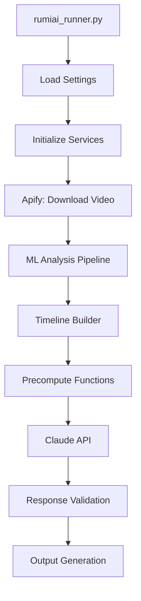

# Complete Dependency Map for ML Precompute Flow

## Table of Contents
1. [Execution Flow Overview](#execution-flow-overview)
2. [Environment Variables](#environment-variables)
3. [Entry Point and Core Files](#entry-point-and-core-files)
4. [Configuration System](#configuration-system)
5. [API Integrations](#api-integrations)
6. [ML Services and Analysis](#ml-services-and-analysis)
7. [Data Processing Pipeline](#data-processing-pipeline)
8. [Precompute Functions](#precompute-functions)
9. [Prompt Management](#prompt-management)
10. [Validation and Output](#validation-and-output)
11. [File I/O Structure](#file-io-structure)
12. [Python Package Dependencies](#python-package-dependencies)
13. [System Dependencies](#system-dependencies)
14. [Missing/Broken Dependencies](#missingbroken-dependencies)

## Execution Flow Overview



## Environment Variables

### Required API Keys
```bash
CLAUDE_API_KEY          # Anthropic API key for Claude
APIFY_API_TOKEN         # Apify API token for TikTok scraping
```

### Feature Flags (Set by User)
```bash
USE_ML_PRECOMPUTE=true      # Enables ML precompute mode
USE_CLAUDE_SONNET=true      # Uses Claude Sonnet instead of Haiku
OUTPUT_FORMAT_VERSION=v2    # Uses 6-block output format
```

### Optional Configuration
```bash
# Logging
LOG_LEVEL=INFO              # Default: INFO
COLORED_LOGS=true           # Default: true

# Processing Limits
MAX_VIDEO_DURATION=180      # Default: 180 seconds
DEFAULT_FPS=2               # Default: 2 fps for analysis
PROMPT_DELAY=10             # Default: 10 seconds between prompts

# Directories (auto-created if missing)
ML_OUTPUTS_DIR=ml_outputs
INSIGHTS_DIR=insights
TEMP_DIR=temp
UNIFIED_ANALYSIS_DIR=unified_analysis
TEMPORAL_MARKERS_DIR=temporal_markers
```

## Entry Point and Core Files

### 1. Main Entry Point
**File**: `scripts/rumiai_runner.py`
```python
# Key imports
from rumiai_v2 import RumiAIV2
from rumiai_v2.api import ApifyClient, ClaudeClient
from rumiai_v2.processors import VideoAnalyzer, TimelineBuilder, TemporalMarkerGenerator
from rumiai_v2.processors import MLDataExtractor, PromptBuilder, OutputAdapter
from rumiai_v2.processors.precompute_functions import get_compute_function, COMPUTE_FUNCTIONS
from rumiai_v2.prompts import PromptManager
from rumiai_v2.config import Settings
from rumiai_v2.validators import ResponseValidator

# Main class
class RumiAIRunner:
    def __init__(self):
        self.settings = Settings()
        self.apify = ApifyClient(self.settings.apify_api_token)
        self.claude = ClaudeClient(self.settings.claude_api_key)
        self.video_analyzer = VideoAnalyzer()
        self.timeline_builder = TimelineBuilder()
        self.prompt_manager = PromptManager()
        self.output_adapter = OutputAdapter()
```

### 2. Settings Configuration
**File**: `rumiai_v2/config/__init__.py`
```python
class Settings:
    # Loads from environment and provides defaults
    def __init__(self):
        self.claude_api_key = os.getenv('CLAUDE_API_KEY')
        self.apify_api_token = os.getenv('APIFY_API_TOKEN')
        self.use_ml_precompute = os.getenv('USE_ML_PRECOMPUTE', 'false').lower() == 'true'
        self.use_claude_sonnet = os.getenv('USE_CLAUDE_SONNET', 'false').lower() == 'true'
        self.output_format_version = os.getenv('OUTPUT_FORMAT_VERSION', 'v1')
```

## Configuration System

### Directory Structure Required
```
RumiAIv2-clean/
├── venv/                          # Python virtual environment
├── scripts/
│   └── rumiai_runner.py          # Entry point
├── rumiai_v2/
│   ├── __init__.py
│   ├── config/
│   │   └── __init__.py           # Settings class
│   ├── api/
│   │   ├── apify_client.py       # TikTok scraping
│   │   ├── claude_client.py      # Claude API
│   │   └── ml_services.py        # ML service wrappers
│   ├── processors/
│   │   ├── video_analyzer.py     # ML analysis orchestration
│   │   ├── timeline_builder.py   # Timeline construction
│   │   ├── precompute_functions.py      # Wrapper functions
│   │   └── precompute_functions_full.py # Actual compute logic
│   ├── prompts/
│   │   └── prompt_manager.py     # Template management
│   └── validators/
│       └── response_validator.py # 6-block validation
├── prompt_templates/             # Claude prompt templates
│   ├── creative_density_v2.txt
│   ├── emotional_journey_v2.txt
│   ├── speech_analysis_v2.txt
│   ├── visual_overlay_analysis_v2.txt
│   ├── metadata_analysis_v2.txt
│   ├── person_framing_v2.txt
│   └── scene_pacing_v2.txt
└── Output directories (auto-created):
    ├── temp/                     # Downloaded videos
    ├── insights/                 # Claude analysis results
    ├── unified_analysis/         # Combined ML data
    ├── temporal_markers/         # Time-based markers
    ├── object_detection_outputs/ # YOLO results
    ├── speech_transcriptions/    # Whisper results
    ├── human_analysis_outputs/   # MediaPipe results
    ├── creative_analysis_outputs/# OCR results
    └── scene_detection_outputs/  # Scene detection results
```

## API Integrations

### 1. Apify API (TikTok Scraping)
**File**: `rumiai_v2/api/apify_client.py`
```python
# Dependencies
import aiohttp
import requests

class ApifyClient:
    BASE_URL = "https://api.apify.com/v2"
    ACTOR_ID = "GdWCkxBtKWOsKjdch"  # TikTok scraper actor
    
    # Required methods
    async def scrape_video(video_url: str) -> Dict
    async def download_video(video_id: str) -> str
```

### 2. Claude API (Anthropic)
**File**: `rumiai_v2/api/claude_client.py`
```python
# Dependencies
from anthropic import Anthropic

class ClaudeClient:
    MODELS = {
        'haiku': 'claude-3-haiku-20240307',
        'sonnet': 'claude-3-5-sonnet-20241022'
    }
    
    MODEL_PRICING = {
        "claude-3-haiku-20240307": {"input": 0.25, "output": 1.25},
        "claude-3-5-sonnet-20241022": {"input": 3.00, "output": 15.00}
    }
```

## ML Services and Analysis

### 1. ML Services Wrapper
**File**: `rumiai_v2/api/ml_services.py`
```python
class MLServices:
    # YOLO Object Detection
    async def run_yolo(video_path: str) -> Dict
    # Currently returns empty results - NEEDS IMPLEMENTATION
    
    # Whisper Transcription
    async def run_whisper(video_path: str) -> Dict
    # Tries to run: venv/bin/python whisper_transcribe.py
    # MISSING FILE: whisper_transcribe.py
    
    # MediaPipe Human Analysis
    async def run_mediapipe(video_path: str) -> Dict
    # Returns empty results - NEEDS IMPLEMENTATION
    
    # OCR Text Detection
    async def run_ocr(video_path: str) -> Dict
    # Returns empty results - NEEDS IMPLEMENTATION
    
    # Scene Detection
    async def run_scene_detection(video_path: str) -> Dict
    # Basic implementation using frame differences
```

### 2. Video Analyzer
**File**: `rumiai_v2/processors/video_analyzer.py`
```python
# Dependencies
import asyncio
from concurrent.futures import ThreadPoolExecutor

class VideoAnalyzer:
    ML_TYPES = ['yolo', 'whisper', 'mediapipe', 'ocr', 'scene_detection']
    
    async def analyze(video_path: str) -> UnifiedAnalysis:
        # Runs all ML analyses in parallel
        # Saves results to respective output directories
```

## Data Processing Pipeline

### 1. Timeline Builder
**File**: `rumiai_v2/processors/timeline_builder.py`
```python
class TimelineBuilder:
    def build_timeline(analysis: UnifiedAnalysis) -> Timeline:
        # Combines all ML outputs into unified timeline
        # Entry types: 'object', 'speech', 'gesture', 'face', 'text_overlay', 'scene_change'
```

### 2. Temporal Marker Generator
**File**: `rumiai_v2/processors/temporal_markers.py`
```python
class TemporalMarkerGenerator:
    def generate_markers(analysis: UnifiedAnalysis) -> Dict:
        # Creates time-based markers for key events
        # Identifies patterns and highlights
```

## Precompute Functions

### 1. Wrapper Functions
**File**: `rumiai_v2/processors/precompute_functions.py`
```python
# Maps prompt types to compute functions
COMPUTE_FUNCTIONS = {
    'creative_density': compute_creative_density_wrapper,
    'emotional_journey': compute_emotional_wrapper,
    'person_framing': compute_person_framing_wrapper,
    'scene_pacing': compute_scene_pacing_wrapper,
    'speech_analysis': compute_speech_wrapper,
    'visual_overlay_analysis': compute_visual_overlay_wrapper,
    'metadata_analysis': compute_metadata_wrapper
}

# Each wrapper extracts data from unified analysis and calls actual compute function
def compute_creative_density_wrapper(analysis_dict: Dict) -> Dict:
    timelines = _extract_timelines_from_analysis(analysis_dict)
    duration = analysis_dict.get('timeline', {}).get('duration', 0)
    return compute_creative_density_analysis(timelines, duration)
```

### 2. Actual Compute Functions
**File**: `rumiai_v2/processors/precompute_functions_full.py`
```python
# Each function generates 30-50 metrics from ML data
def compute_creative_density_analysis(timelines: Dict, duration: float) -> Dict:
    # Returns: avgDensity, maxDensity, elementCounts, densityCurve, etc.

def compute_emotional_metrics(timelines, speech_timeline, gesture_timeline, duration) -> Dict:
    # Returns: emotionTransitions, dominantEmotion, emotionalArc, etc.

# ... 5 more compute functions ...
```

## Prompt Management

### 1. Prompt Manager
**File**: `rumiai_v2/prompts/prompt_manager.py`
```python
class PromptManager:
    def __init__(self, template_dir: str = "prompt_templates"):
        # Loads all _v2.txt templates at startup
        
    def format_prompt(prompt_type: str, context: Dict) -> str:
        # Inserts precomputed metrics into template
        # Adds context data and formatting
```

### 2. Prompt Templates
**Directory**: `prompt_templates/`
- Each template defines expected 6-block output structure
- Contains instructions for JSON-only output
- Defines specific metrics for each block type

## Validation and Output

### 1. Response Validator
**File**: `rumiai_v2/validators/response_validator.py`
```python
class ResponseValidator:
    EXPECTED_BLOCKS = ['CoreMetrics', 'Dynamics', 'Interactions', 
                       'KeyEvents', 'Patterns', 'Quality']
    
    # Block name mappings for each prompt type
    BLOCK_NAME_MAPPINGS = {
        'creative_density': {
            'densityCoreMetrics': 'CoreMetrics',
            'densityDynamics': 'Dynamics',
            # ... etc
        }
    }
    
    @classmethod
    def validate_6block_response(response_text: str, prompt_type: str) -> Tuple[bool, Dict, List]:
        # Validates JSON structure
        # Normalizes block names
        # Checks required fields
```

### 2. Output Adapter
**File**: `rumiai_v2/processors/output_adapter.py`
```python
class OutputAdapter:
    def convert_6block_to_legacy(data: Dict, prompt_type: str) -> Dict:
        # Converts v2 format to v1 for backward compatibility
```

## File I/O Structure

### Input Files
```
temp/
└── {video_id}.mp4                # Downloaded TikTok video
```

### ML Output Files
```
object_detection_outputs/
└── {video_id}/
    └── {video_id}_yolo_detections.json

speech_transcriptions/
└── {video_id}_whisper.json

human_analysis_outputs/
└── {video_id}/
    └── {video_id}_human_analysis.json

creative_analysis_outputs/
└── {video_id}/
    └── {video_id}_creative_analysis.json

scene_detection_outputs/
└── {video_id}/
    └── {video_id}_scenes.json
```

### Analysis Output Files
```
unified_analysis/
└── {video_id}.json               # Combined ML data

temporal_markers/
└── {video_id}_{timestamp}.json   # Time-based markers

insights/
└── {video_id}/
    ├── creative_density/
    │   └── creative_density_complete_{timestamp}.json
    ├── emotional_journey/
    │   └── emotional_journey_complete_{timestamp}.json
    └── ... (5 more prompt types)
```

## Python Package Dependencies

### Core Requirements
```txt
# API Clients
anthropic>=0.3.0
aiohttp>=3.8.0
requests>=2.25.0

# Video Processing
opencv-python>=4.5.0
moviepy>=1.0.3
ffmpeg-python>=0.2.0

# ML Models
whisper>=1.0.0              # OpenAI Whisper
ultralytics>=8.0.0          # YOLO
mediapipe>=0.9.0            # Google MediaPipe
easyocr>=1.6.0              # OCR
torch>=1.9.0                # PyTorch (for ML models)
transformers>=4.0.0         # Hugging Face

# Data Processing
numpy>=1.19.0
pandas>=1.3.0
scipy>=1.7.0
scikit-learn>=0.24.0

# Utilities
python-dotenv>=0.19.0
psutil>=5.8.0               # System monitoring
colorama>=0.4.4             # Colored logs
tqdm>=4.62.0                # Progress bars
```

### Development Dependencies
```txt
pytest>=6.2.0
pytest-asyncio>=0.18.0
black>=21.0
flake8>=3.9.0
mypy>=0.910
```

## System Dependencies

### Required System Packages
```bash
# Video Processing
ffmpeg                      # Video manipulation
libglib2.0-0               # MediaPipe dependency
libsm6                     # OpenCV dependency
libxext6                   # OpenCV dependency
libxrender-dev             # OpenCV dependency
libgomp1                   # OpenCV dependency

# ML Acceleration (Optional)
cuda-toolkit-11.x          # For GPU acceleration
cudnn                      # Deep learning primitives
```

### Hardware Requirements
- **Minimum RAM**: 4GB
- **Recommended RAM**: 8GB+
- **GPU**: Optional but recommended (10-30x speedup)
- **Storage**: 10GB+ for models and outputs

## Missing/Broken Dependencies

### 1. Missing ML Script
**File**: `whisper_transcribe.py`
- Referenced by MLServices but doesn't exist
- Should be created in project root or ml_scripts/

### 2. Unimplemented ML Services
- YOLO service returns empty results
- MediaPipe service returns empty results
- OCR service returns empty results

### 3. Missing Model Files
- Whisper models need to be downloaded
- YOLO models need to be downloaded
- EasyOCR models download on first use

### 4. Configuration Files (Optional)
- `.env` file for environment variables
- `config.yaml` for advanced settings (not implemented)

## Initialization Sequence

1. **Load Environment Variables**
   ```python
   # From environment or .env file
   load_dotenv()
   ```

2. **Initialize Settings**
   ```python
   settings = Settings()
   # Validates API keys exist
   ```

3. **Create Output Directories**
   ```python
   for directory in OUTPUT_DIRS:
       os.makedirs(directory, exist_ok=True)
   ```

4. **Initialize Services**
   ```python
   apify = ApifyClient(settings.apify_api_token)
   claude = ClaudeClient(settings.claude_api_key)
   video_analyzer = VideoAnalyzer()
   ```

5. **Load ML Models (Lazy)**
   ```python
   # Models loaded on first use to save memory
   ```

6. **Load Prompt Templates**
   ```python
   prompt_manager = PromptManager()
   # Loads all _v2.txt templates
   ```

## Error Recovery

### API Failures
- Apify: Retries with exponential backoff
- Claude: Retries up to 3 times
- ML Services: Currently no retry (should be added)

### File I/O Errors
- Auto-creates missing directories
- Logs warnings for missing files
- Falls back to empty data (problematic)

### Memory Management
- Monitors memory usage
- Triggers garbage collection at 4GB
- Should implement OOM prevention

## Testing the Flow

### 1. Verify Environment
```bash
# Check Python version
python --version  # Should be 3.8+

# Check virtual environment
source venv/bin/activate

# Check packages
pip list | grep -E "anthropic|aiohttp|opencv|whisper"
```

### 2. Test ML Services
```python
# Test each ML service individually
python -c "from rumiai_v2.api.ml_services import MLServices; print(MLServices())"
```

### 3. Run Full Pipeline
```bash
# Set environment
export CLAUDE_API_KEY="your-key"
export APIFY_API_TOKEN="your-token"
export USE_ML_PRECOMPUTE=true
export USE_CLAUDE_SONNET=true
export OUTPUT_FORMAT_VERSION=v2

# Run
./venv/bin/python scripts/rumiai_runner.py "video-url"
```

## Common Issues and Solutions

1. **"No such file or directory: whisper_transcribe.py"**
   - Create the missing script or fix MLServices to use whisper directly

2. **Empty ML results**
   - Implement actual ML service methods
   - Ensure models are downloaded

3. **Low confidence scores**
   - Fix ML data extraction
   - Ensure precompute functions receive proper data

4. **High API costs**
   - Add data quality checks before Claude calls
   - Use Haiku for low-quality data

This dependency map provides a complete view of the ML precompute system, highlighting both working components and areas needing fixes.