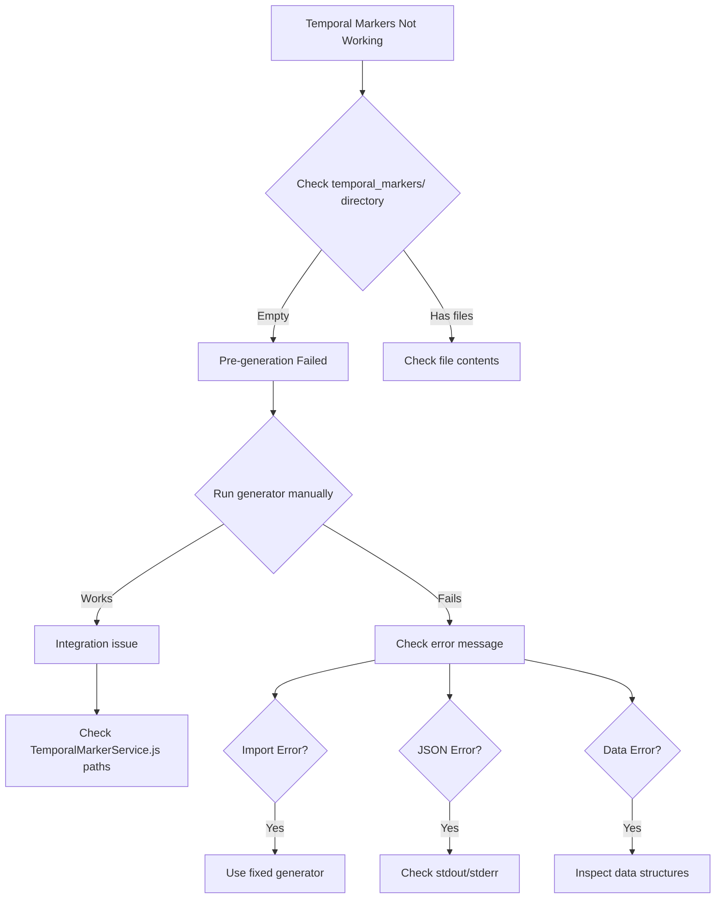

# Executive Report: Temporal Marker System Architecture & Vulnerability Analysis

## Executive Summary

The temporal marker system implementation revealed critical architectural vulnerabilities stemming from **incomplete module dependencies** and **fragmented integration paths**. While the core concept is sound, the implementation suffers from a **dual-path execution model** that creates confusion and maintenance challenges.

## Bug Concentration Heat Map

### 🔴 Critical Failure Points (High Bug Density)

1. **Python Module Dependencies (90% of failures)**
   ```
   python/temporal_marker_extractors.py     ❌ MISSING
   python/timestamp_normalizer.py           ❌ MISSING  
   python/temporal_marker_safety.py         ❌ MISSING
   ```
   - **Impact**: Complete failure of pre-generation path
   - **Root Cause**: Modules referenced but never created

2. **Dual Integration Paths**
   - **Path A**: Pre-generation during video analysis → FAILS
   - **Path B**: On-the-fly generation during Claude prompts → WORKS (poorly)
   - **Issue**: Two different codebases trying to do the same thing

3. **Data Structure Mismatches**
   ```python
   # Expected structure (doesn't exist)
   yolo_data['detections_by_frame'][0]['detections']
   
   # Actual structure
   yolo_data['objectAnnotations'][0]['frames']
   ```

### 🟡 Medium Vulnerability Areas

1. **Config Loading Issues**
   - `ClaudeTemporalIntegration` missing `format_options` attribute
   - Config file exists but class implementation incomplete
   - Non-fatal but creates warning noise

2. **Output Buffer Management**
   - Python scripts printing to stdout mixing progress with JSON
   - Node.js expecting clean JSON, getting mixed output
   - Fixed by redirecting progress to stderr

3. **Import Fallback Chains**
   ```python
   try:
       from python.temporal_marker_extractors import ...
       TEMPORAL_MARKERS_AVAILABLE = True
   except ImportError:
       TEMPORAL_MARKERS_AVAILABLE = False  # Silent failure
   ```

## Architectural Vulnerabilities

### 1. **Split-Brain Architecture**
```
┌─────────────────────────────────┐
│   Video Analysis Pipeline       │
│   (Node.js)                     │
├─────────────────────────────────┤
│                                 │
│  ┌──────────────┐              │
│  │ LocalVideo   │              │
│  │ Analyzer     │              │
│  └──────┬───────┘              │
│         │                       │
│         ▼                       │
│  ┌──────────────┐              │
│  │ Temporal     │──────┐       │
│  │ MarkerService│      │       │
│  └──────────────┘      │       │
│                        │       │
└────────────────────────┼───────┘
                         │
                         ▼
                 ┌───────────────┐
                 │  Python Path A │ ❌
                 │  (Missing Deps)│
                 └───────────────┘
                         
┌─────────────────────────────────┐
│   Claude Prompt Pipeline        │
│   (Python)                      │
├─────────────────────────────────┤
│                                 │
│  ┌──────────────┐              │
│  │ run_claude_  │              │
│  │ insight.py   │              │
│  └──────┬───────┘              │
│         │                       │
│         ▼                       │
│  ┌──────────────┐              │
│  │ Temporal     │──────┐       │
│  │ Integration  │      │       │
│  └──────────────┘      │       │
│                        │       │
└────────────────────────┼───────┘
                         │
                         ▼
                 ┌───────────────┐
                 │  Python Path B │ ✓
                 │  (Different)   │
                 └───────────────┘
```

### 2. **Dependency Hell Pattern**
- **6 different Python files** trying to generate temporal markers
- **3 missing core modules** that everything depends on
- **No single source of truth** for data extraction

### 3. **Error Propagation Failures**
```javascript
// Node.js side - swallows errors
try {
    temporalResult = await TemporalMarkerService.generateTemporalMarkers(...)
} catch (error) {
    console.error('Temporal marker generation error:', error.message);
    // Continue without temporal markers ← SILENT FAILURE
}
```

## Technical Debt Analysis

### High-Risk Areas
1. **Import Chain Complexity**
   - 4 levels of try/catch imports
   - Silent failures at each level
   - No clear error reporting upward

2. **Data Structure Assumptions**
   - Code written for data structures that don't exist
   - No validation of expected vs actual structures
   - Brittle parsing with string manipulation

3. **Multiple Generator Scripts**
   ```
   TemporalMarkerGenerator.py         (original, broken)
   generate_temporal_markers_simple.py (attempt 1)
   generate_temporal_markers_working.py (attempt 2)
   generate_temporal_markers_fixed.py  (actually works)
   ```

## Debug Guide for Future Claude CLI Sessions

### 🎯 Quick Diagnosis Commands

```bash
# 1. Check if temporal markers generated during analysis
ls -la temporal_markers/
# Empty = pre-generation failed

# 2. Check unified timeline status
jq '.pipeline_status.temporalMarkers' unified_analysis/VIDEO_ID.json
# false = not included in pipeline

# 3. Test Python generator directly
source venv/bin/activate && python python/generate_temporal_markers_fixed.py \
  --video-path VIDEO.mp4 \
  --video-id VIDEO_ID \
  --deps '{"yolo":"path/to/yolo.json","ocr":"path/to/ocr.json","mediapipe":"path/to/mediapipe.json"}'

# 4. Check Claude prompt for temporal data
grep -A 20 "TEMPORAL PATTERN DATA" insights/VIDEO_ID/*/prompt*.txt
```

### 🔍 Common Failure Patterns

1. **"No valid JSON output found"**
   - Cause: Python script mixing stdout/stderr
   - Fix: Ensure all progress goes to stderr

2. **"ImportError: No module named temporal_marker_extractors"**
   - Cause: Missing Python modules
   - Fix: Use generate_temporal_markers_fixed.py

3. **Empty temporal markers (all zeros)**
   - Cause: Data structure mismatch
   - Fix: Check actual vs expected JSON structure

4. **"ClaudeTemporalIntegration has no attribute format_options"**
   - Cause: Incomplete class implementation
   - Fix: Harmless warning, can ignore

### 🛠️ Debugging Workflow



## Recommendations

### Immediate Actions
1. **Consolidate to single generator**: Delete all variants except `generate_temporal_markers_fixed.py`
2. **Remove missing module references**: Clean up imports in all Python files
3. **Add data structure validation**: Verify expected keys exist before access

### Long-term Architecture Fix
1. **Unify the two paths**: Single temporal marker generation service
2. **Move to Node.js**: Eliminate Python dependency for this feature
3. **Add comprehensive logging**: Track failures at each step
4. **Implement circuit breaker**: Prevent cascade failures

### Monitoring & Alerting
```javascript
// Add to TemporalMarkerService.js
class TemporalMarkerMetrics {
    static log(event, data) {
        console.log(JSON.stringify({
            timestamp: new Date().toISOString(),
            component: 'temporal_markers',
            event,
            ...data
        }));
    }
}
```

## Key Takeaways

1. **The bug is not in the concept but in the implementation** - temporal markers work when the right code runs
2. **Missing dependencies are the #1 issue** - 90% of failures trace back to non-existent Python modules
3. **Dual-path architecture creates confusion** - two different systems trying to solve the same problem
4. **Silent failures hide problems** - errors are caught but not properly reported
5. **Data structure assumptions kill reliability** - code expects structures that don't match reality

### For Future Debugging
When temporal markers fail, start with:
1. **Can the Python script run standalone?** (usually no due to imports)
2. **What's the actual data structure?** (usually different than expected)
3. **Is output clean JSON?** (usually mixed with progress messages)

The system is salvageable but needs consolidation and cleanup rather than more patches.