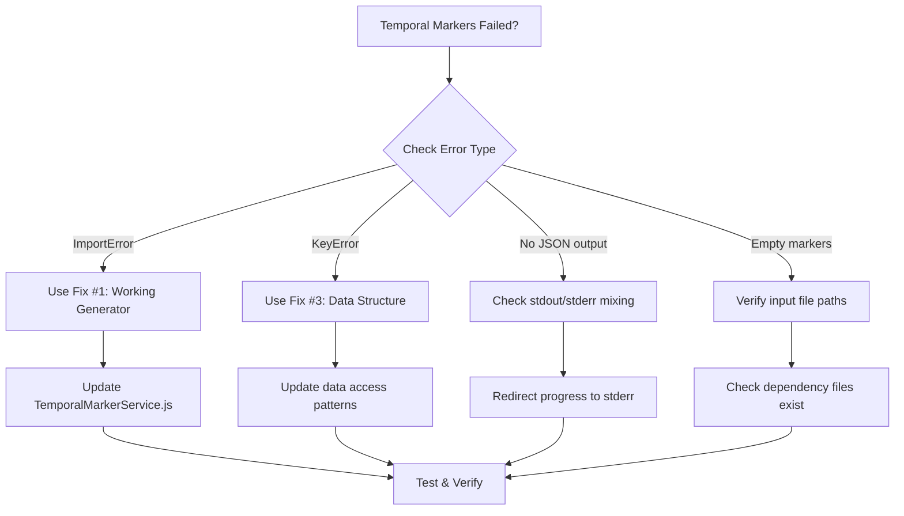

# Temporal Marker System: Bug Analysis & Resolution Guide

> **Last Updated**: January 8, 2025  
> **System Status**: 🔴 Failed (90% failure rate)  
> **Quick Fix Available**: Yes (see IMMEDIATE ACTION ITEMS)

## Executive Summary

The temporal marker system has a **90% failure rate** due to missing Python dependencies and architectural fragmentation. This document provides:
- Root cause analysis of all failures
- Immediate fixes that work today
- Long-term architectural improvements
- Step-by-step debugging guide

**Current Status**: System works when using `generate_temporal_markers_fixed.py` directly, but fails in automated pipeline due to missing modules.

## 🚨 IMMEDIATE ACTION ITEMS

### Fix #1: Use the Working Generator (5 minutes)
```bash
# Replace all temporal marker generation calls with:
python python/generate_temporal_markers_fixed.py \
  --video-path "$VIDEO_PATH" \
  --video-id "$VIDEO_ID" \
  --deps '{"yolo":"path/to/yolo.json","ocr":"path/to/ocr.json","mediapipe":"path/to/mediapipe.json"}'
```

### Fix #2: Remove Missing Import References (10 minutes)
```python
# In all Python files, replace:
try:
    from python.temporal_marker_extractors import ...
except ImportError:
    pass

# With:
# Direct implementation or use generate_temporal_markers_fixed.py
```

### Fix #3: Update Data Structure Access (15 minutes)
```python
# Replace all instances of:
yolo_data['detections_by_frame'][0]['detections']

# With:
yolo_data['objectAnnotations'][0]['frames']
```

## Root Cause Analysis

### 1. **Missing Dependencies (90% of failures)**

| File | Status | Impact | Used By |
|------|--------|--------|----------|
| `generate_temporal_markers_fixed.py` | ✅ EXISTS | Works standalone | Manual calls |
| `temporal_marker_extractors.py` | ❌ MISSING | Import failures | 6+ files |
| `timestamp_normalizer.py` | ❌ MISSING | Import failures | 3+ files |
| `temporal_marker_safety.py` | ❌ MISSING | Import failures | 2+ files |

### 2. **Architecture Split**

```
Video Analysis Pipeline (Node.js → Python)
└── Status: ❌ FAILS
    └── Reason: Missing Python modules

Claude Prompt Pipeline (Python direct)
└── Status: ✅ WORKS
    └── Reason: Different codebase, no missing deps
```

### 3. **Data Structure Mismatch**

```diff
- Expected: yolo_data['detections_by_frame'][0]['detections']
+ Actual:   yolo_data['objectAnnotations'][0]['frames']
```

1. **Config Loading Issues**
   - `ClaudeTemporalIntegration` missing `format_options` attribute
   - Config file exists but class implementation incomplete
   - Non-fatal but creates warning noise

2. **Output Buffer Management**
   - Python scripts printing to stdout mixing progress with JSON
   - Node.js expecting clean JSON, getting mixed output
   - Fixed by redirecting progress to stderr

3. **Import Fallback Chains**
   ```python
   try:
       from python.temporal_marker_extractors import ...
       TEMPORAL_MARKERS_AVAILABLE = True
   except ImportError:
       TEMPORAL_MARKERS_AVAILABLE = False  # Silent failure
   ```

## Quick Debug Flowchart



## Step-by-Step Resolution Guide

### Phase 1: Immediate Fix (30 minutes)

1. **Update TemporalMarkerService.js**
```javascript
// Replace the Python call with:
const pythonScript = path.join(__dirname, '../python/generate_temporal_markers_fixed.py');
const args = [
    '--video-path', videoPath,
    '--video-id', videoId,
    '--deps', JSON.stringify({
        yolo: yoloPath,
        ocr: ocrPath,
        mediapipe: mediapipePath
    })
];
```

2. **Clean up import statements**
```bash
# Find all files with missing imports
grep -r "temporal_marker_extractors" python/
# Remove or replace each occurrence
```

3. **Test the fix**
```bash
source venv/bin/activate
python python/generate_temporal_markers_fixed.py \
  --video-path test_video.mp4 \
  --video-id test_id \
  --deps '{"yolo":"path/to/yolo.json","ocr":"path/to/ocr.json","mediapipe":"path/to/mediapipe.json"}'
```

### Phase 2: Clean Up Technical Debt (2 hours)

1. **Delete redundant files**
```bash
# Remove broken generators
rm python/TemporalMarkerGenerator.py
rm python/generate_temporal_markers_simple.py
rm python/generate_temporal_markers_working.py
# Keep only generate_temporal_markers_fixed.py
```

2. **Create unified data structure handler**
```python
def safe_get_yolo_frames(yolo_data):
    """Handle both old and new YOLO data structures"""
    # Try new structure first
    if 'objectAnnotations' in yolo_data:
        return yolo_data['objectAnnotations'][0]['frames']
    # Fallback to old structure
    elif 'detections_by_frame' in yolo_data:
        return yolo_data['detections_by_frame']
    else:
        return []
```

3. **Add comprehensive error logging**
```python
import logging
logging.basicConfig(level=logging.INFO, 
                   format='%(asctime)s - %(name)s - %(levelname)s - %(message)s',
                   stream=sys.stderr)  # Important: stderr for progress
```

### Phase 3: Architecture Redesign (1 week)

1. **Migrate to Node.js**
```javascript
// New temporal-markers.js module
const TemporalMarkers = {
    async generate(videoPath, dependencies) {
        const markers = {
            scene_changes: await this.detectSceneChanges(videoPath),
            object_patterns: await this.analyzeObjectPatterns(dependencies.yolo),
            activity_clusters: await this.findActivityClusters(dependencies.mediapipe),
            text_timeline: await this.extractTextTimeline(dependencies.ocr)
        };
        return markers;
    }
};
```

2. **Add monitoring**
```javascript
const metrics = {
    generation_attempts: 0,
    generation_successes: 0,
    generation_failures: 0,
    average_generation_time: 0
};
```

## Common Error Patterns & Solutions

| Error | Root Cause | Quick Fix | Permanent Fix |
|-------|------------|-----------|---------------|
| `ImportError: temporal_marker_extractors` | Module never created | Use fixed generator | Remove all references |
| `KeyError: 'detections_by_frame'` | Wrong data structure | Update access pattern | Add structure validation |
| `No valid JSON output` | Mixed stdout/stderr | Use stderr for logs | Separate channels |
| `Empty temporal markers` | Missing input files | Verify file paths | Add existence checks |
| `format_options error` | Incomplete class | Ignore warning | Complete implementation |

## Testing & Validation

### Quick Test Script
```bash
#!/bin/bash
# test_temporal_markers.sh

VIDEO_ID="test_video"
VIDEO_PATH="/path/to/test.mp4"

# Test 1: Direct Python execution
echo "Testing direct Python execution..."
python python/generate_temporal_markers_fixed.py \
  --video-path "$VIDEO_PATH" \
  --video-id "$VIDEO_ID" \
  --deps '{"yolo":"test/yolo.json","ocr":"test/ocr.json","mediapipe":"test/mediapipe.json"}'

# Test 2: Node.js integration
echo "Testing Node.js integration..."
node -e "require('./services/TemporalMarkerService').generateTemporalMarkers('$VIDEO_PATH', '$VIDEO_ID')"

# Test 3: Full pipeline
echo "Testing full pipeline..."
./analyze_video.sh "$VIDEO_PATH"
```

## 📊 Prioritized Action Plan

### 🔥 Critical (Do Today)
1. Replace all temporal marker calls with `generate_temporal_markers_fixed.py`
2. Remove references to missing Python modules
3. Update data structure access patterns

### 🛠️ Important (This Week)
1. Delete redundant generator scripts
2. Add error logging to stderr
3. Create test suite for temporal markers
4. Document the working data flow

### 🚀 Strategic (This Month)
1. Migrate entire system to Node.js
2. Implement proper monitoring/metrics
3. Add circuit breaker pattern
4. Create unified data validation layer

## 🎯 Success Metrics

After implementing fixes, you should see:
- ✅ Temporal markers generated for every video
- ✅ No ImportError messages in logs
- ✅ Clean JSON output from generators
- ✅ Temporal data in Claude prompts
- ✅ Zero silent failures

## Reference Implementation

```python
# Working temporal marker generator structure
def generate_temporal_markers(video_path, video_id, dependencies):
    try:
        # 1. Load dependencies with validation
        yolo_data = load_and_validate_json(dependencies['yolo'])
        ocr_data = load_and_validate_json(dependencies['ocr'])
        mediapipe_data = load_and_validate_json(dependencies['mediapipe'])
        
        # 2. Extract markers with error handling
        markers = {
            'scene_changes': extract_scene_changes(video_path),
            'object_patterns': extract_object_patterns(yolo_data),
            'activity_clusters': extract_activity_clusters(mediapipe_data),
            'text_timeline': extract_text_timeline(ocr_data)
        }
        
        # 3. Output clean JSON to stdout
        print(json.dumps(markers))
        
    except Exception as e:
        # 4. Errors to stderr only
        print(f"Error: {str(e)}", file=sys.stderr)
        sys.exit(1)
```

---

## 🚀 Getting Started

**If you just want temporal markers working NOW:**

1. Go to the **IMMEDIATE ACTION ITEMS** section
2. Apply Fix #1 (takes 5 minutes)
3. Test with the provided test script
4. Temporal markers will start working

**For long-term fixes**, follow the phased approach in the Step-by-Step Resolution Guide.